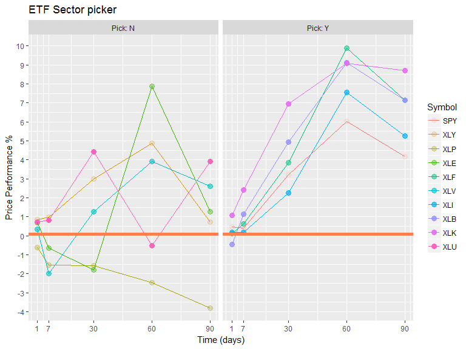

GetTicker Introduction
----------------------

The GetTicker.R is a small R program that can analysis the stock
performance across sector. The usage of the script is to call
GetTicker() and it will default retrieve 9 sector's ETF stock price
across different time periods. It will then output the top 5 stock
performer and output in R.

Example output
--------------

For example, the following call of function GetTicker shows the graphs.

    source("GetTicker.R")
    GetTicker()

    ## [1] "Pick the top 5 performer according to mean performance of week,30, 60, 90 days:"

    ## # A tibble: 5 x 2
    ## # Groups:   Symbol [5]
    ##   Symbol MeanPerf
    ##   <fctr>    <dbl>
    ## 1    XLK    5.642
    ## 2    XLB    4.374
    ## 3    XLF    4.320
    ## 4    XLI    3.080
    ## 5    SPY    2.856
